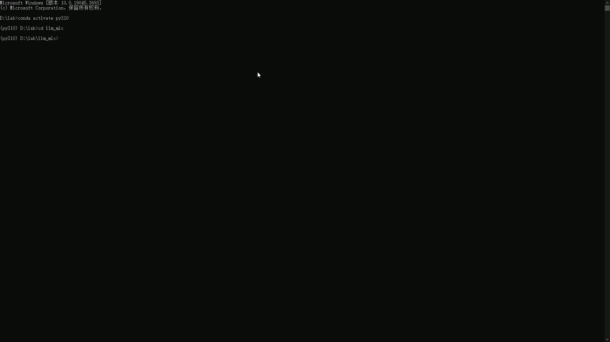
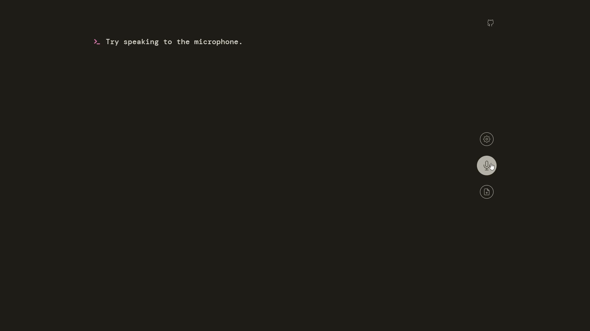

# Introduction
Self-built Local AI Agent visualization demo, which were only using CPU to perform inference.

## Object Detection

## Multi Person Tracking

## Face Dectection

## Portrait Segmentation

## Super-Resolution Enhance

## Text Classification

## Text to Image generation

## TTS

## Kubernetes / KubeSphere

## One-API Forward Req From OpenAI/Embedding/Ollama/ChatGLM/Qwen

## LLM Agent in LangChain

## Async Stream Token Generation

## gRPC

## LLM Chat with MicroPhone

- Terminal

- React

## QQ - Chinese Chat App
