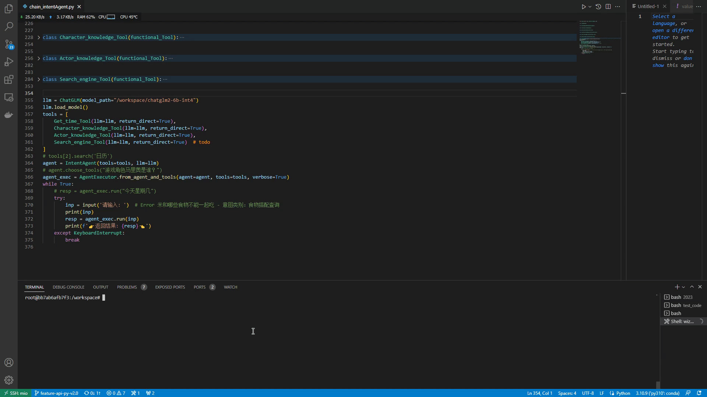
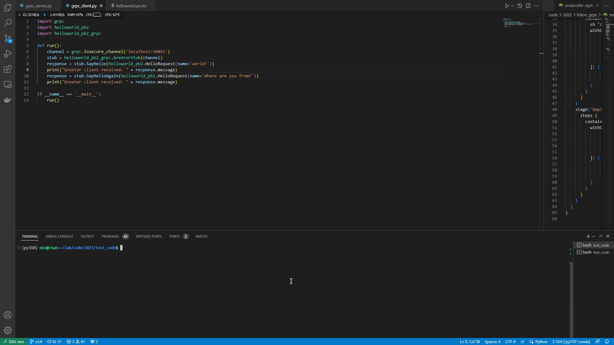

# 开始
以下均为cpu推理

## 目标检测

## 跟踪

## 人脸检测和关键点

## 分割

## 增强

## 文本分类

## 文本生成图片

## 文本生成语音

## k8s
k8s管理服务

## one-api中转集成LLM和embedding
集成LLM模型封装成统一API，并使用该one-api进行对话。包含m3e生成向量，向量库匹配获取得分和排名。

## LLM Agent
LLM充当Agent角色，根据user输入执行不同的指令完成任务。

参考以下这位大佬的代码，改成使用本地LLM，而非openai。搜索引擎和天气等信息需要自行申请api，集成到Agent。
> [B站: 爱的生命只有82分钟，我要给她完整的一生😭](https://www.bilibili.com/video/BV1md4y1Z7pj/?spm_id_from=333.999.0.0&vd_source=afa6a4d92a2a676ee929209b5bb17202)

## 异步stream和本地知识库
关联本地知识库，并使用异步接收每个字token，进而打印输出。

## grpc

可ghz进行压测